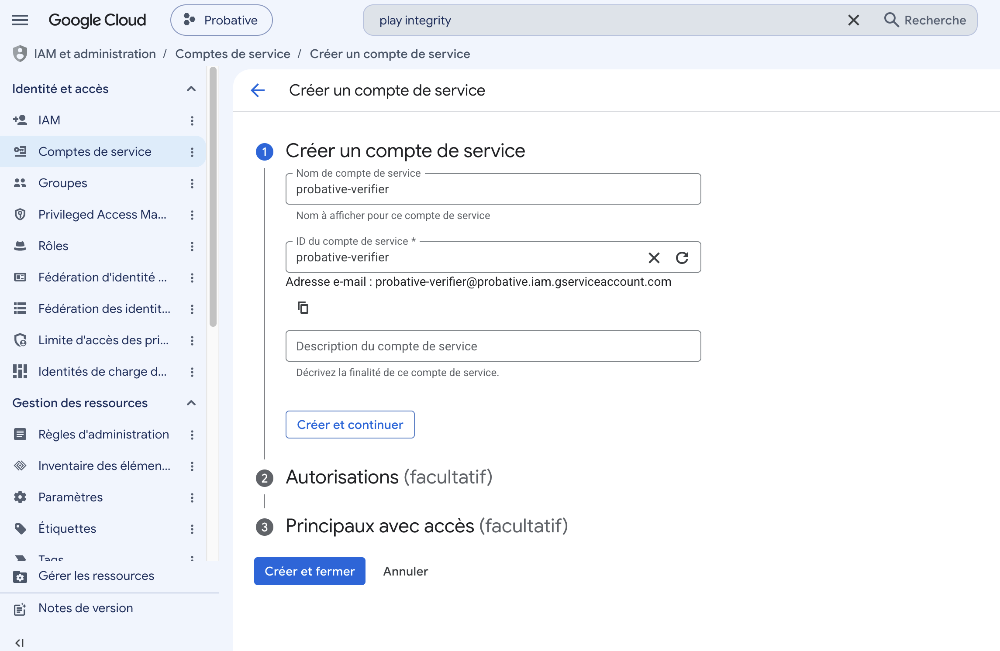
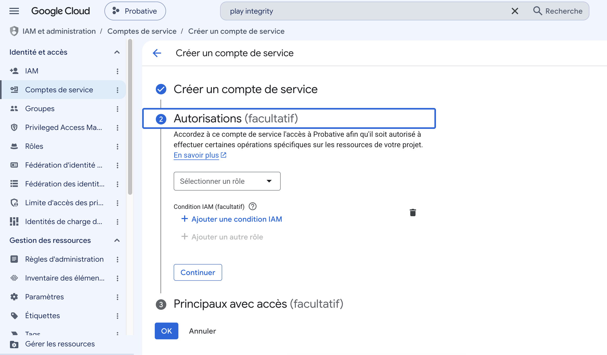
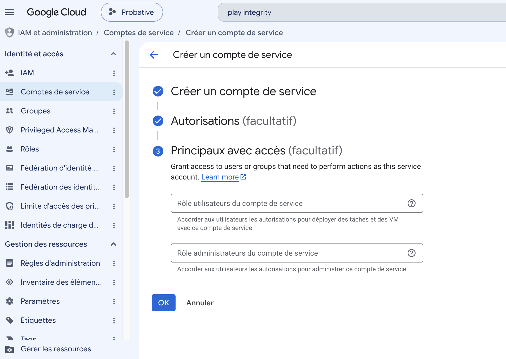
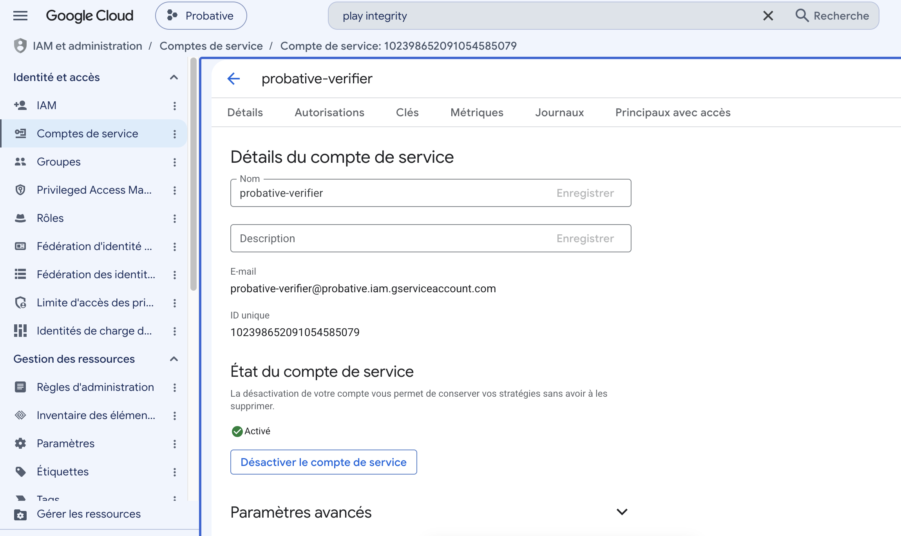
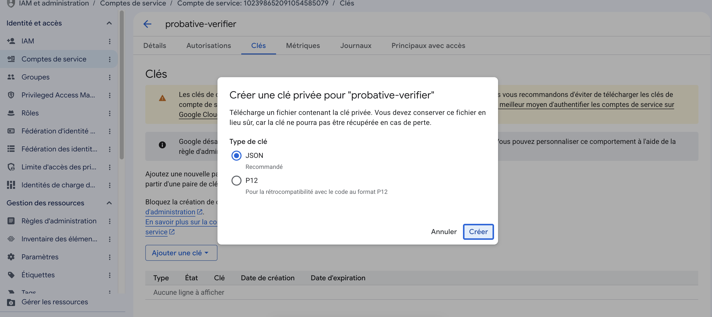
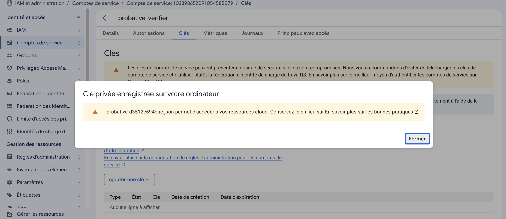
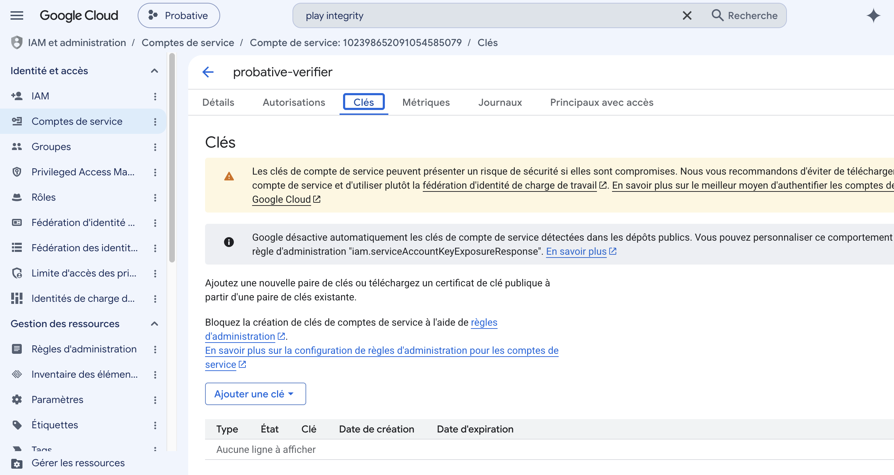

# Compte de service Google — déchiffrement des jetons Play Integrity

**Statut : procédure, à exécuter une fois.** Prérequis logistique de la **phase B**
(`PlayIntegrityVerifier`), décrite dans `spike-attestation.md`. Ce document existe
parce que la démarche est administrative, lente, et qu'elle conditionne la seule
chose qui rende la boucle Android opposable : lire réellement le verdict d'un jeton
au lieu de constater qu'un jeton a été délivré.

Il couvre deux démarches distinctes : le **compte de service** qui permet de déchiffrer
les jetons (§1 à §7), et la **publication en test interne** qui seule permet d'exercer
`PLAY_RECOGNIZED` (§8). La seconde n'est pas nécessaire à la phase B ; elle l'est pour
savoir ce que le chemin nominal produit.

**Daté du 2026-08-12.** Les consoles Google et leur documentation bougent ; les faits
cités sont sourcés en fin de document. Revérifier avant de s'appuyer sur un détail
d'interface.

---

## 1. Ce que la procédure débloque, et pourquoi elle ne peut pas être contournée

**Obtenir un jeton n'est pas passer un contrôle.** La sonde A5 a obtenu un jeton
Play Integrity sur SM-X200, mais ce jeton est **chiffré et n'a jamais été ouvert**.
Tant qu'il n'est pas déchiffré, on ignore trois choses qui comptent toutes :

- le verdict d'appareil (`deviceIntegrity`) et le verdict d'application
  (`appRecognitionVerdict`) — très probablement `UNRECOGNIZED_VERSION` ici, puisque
  l'application n'est pas publiée ;
- si Google **restitue le `requestHash` intact**, donc si la règle R1 tient
  réellement de bout en bout côté Android. C'est la dernière réserve de l'inconnue
  n° 1 : un encodage qui divergerait entre client et serveur **casserait R1 en
  silence**, ce qui est le pire mode de défaillance possible ;
- si la chaîne d'attestation de clé remonte bien à la racine publiée par Google —
  contrôle distinct, traité à l'enrôlement, mais qui appartient à la même phase B.

Aucun travail local ne remplace cet appel : le jeton est chiffré par Google.

---

## 2. Le déchiffrement local n'est pas une option ouverte à ce projet

Play Integrity propose deux modes de déchiffrement. **Un seul nous est accessible**,
et ce n'est pas un choix de conception : c'est une contrainte subie.

| Mode | Disponible ici | Raison |
|---|---|---|
| Google déchiffre (`decodeIntegrityToken`) | **Oui** | Aucune condition de distribution |
| Clés détenues, déchiffrement local | **Non** | Les clés se téléchargent depuis la Play Console, et l'application doit être publiée sur Google Play |

La documentation est explicite : *« To decrypt locally within your own secure server
environment, you can download encryption keys from the Play Console or the Play SDK
Console. **Your app must be available on Google Play to use this feature.** »*

Or la trouvaille d'A5 est précisément que ce dépôt sert aussi des applications
distribuées **hors** du Play Store — c'est ce que `setCloudProjectNumber` prend en
charge officiellement, et c'est ce qui fait sa valeur pour une bibliothèque destinée
à être réutilisée. Le prix de cette liberté est ici : **hors du Play Store, le
déchiffrement local est fermé.**

### Les quatre conséquences, à assumer et non à minimiser

1. **Un appel réseau par enveloppe**, en plein chemin de vérification. Latence et
   mode dégradé à traiter explicitement dans `PlayIntegrityVerifier`.
2. **Une dépendance de disponibilité** : si l'API Google est indisponible, aucune
   enveloppe Android ne peut être jugée. Le comportement attendu dans ce cas est une
   décision de conception, pas un détail — il devra apparaître dans le résultat
   structuré, jamais être confondu avec un rejet.
3. **Un plafond de 10 000 requêtes/jour**, adossé au numéro de projet Cloud. Ce
   plafond compte *à la fois* les demandes de jeton côté client et les appels de
   déchiffrement côté serveur — donc **environ 5 000 enveloppes par jour**.
   **Et il n'est pas négociable :** l'augmentation de quota exige elle aussi que
   l'application soit disponible sur Google Play, et *« quota requests from unlinked
   projects will be rejected »*. Même verrou que pour les clés locales.
4. **L'argument d'auto-hébergement est entamé** côté Android. Le vérificateur reste
   auto-hébergeable, mais il ne peut plus juger une enveloppe Android hors ligne. Côté
   iOS, rien de tel : la phase D valide App Attest **sans appeler Apple**.

**Le seul moyen de desserrer tout cela est de publier l'application sur le Play
Store** — décision de distribution, pas d'architecture. À ne pas prendre ici.

**Ce constat tient toujours après l'exécution du 2026-08-12.** Le déchiffrement par
Google, lui, fonctionne sans Play Console (§7) — mais le déchiffrement *local* reste
adossé à une condition de distribution que ce projet ne remplit pas. Les quatre
conséquences ci-dessus sont donc à assumer telles quelles.

Elles ne se lèveraient qu'en publiant l'application sur le Play Store, ce qui
rouvrirait la question du mode de déchiffrement et rendrait au vérificateur son
auto-hébergement complet. **C'est un arbitrage de distribution, à instruire seulement
si le déploiement visé le justifie** — la phase B, elle, n'en dépend pas.

---

## 3. Où doit vivre le compte de service

Dans le projet Cloud **`probative`, numéro `487335590129`** — exactement celui que le
module `:demo` passe à `setCloudProjectNumber`. La documentation de
`IntegrityTokenRequest.Builder` tranche : *« Calls to decrypt the token on Google's
server must be authenticated using the cloud account that was linked to the token in
this request. »*

**Conséquence utile : aucune démarche Play Console n'est nécessaire.** Le lien attendu
par Google est celui que porte déjà le jeton — **confirmé le 2026-08-12 par le
déchiffrement d'un jeton réel de la SM-X200, en HTTP 200** (§7). Ni rôle IAM, ni
enregistrement dans la Play Console : l'appartenance au projet Cloud suffit.

*Cette phrase a été un temps barrée comme erronée, sur la foi d'un refus obtenu avec un
jeton volontairement invalide. Le jeton réel l'a rétablie. Le détour est conservé en §7
parce que la méthode qu'il enseigne vaut plus que la conclusion.*

---

## 4. Procédure — console web

1. **Console Cloud**, sélectionner le projet `probative`. Vérifier le **numéro**
   `487335590129`, pas le nom : deux projets peuvent porter le même nom, un seul porte
   ce numéro, et c'est le numéro qui est inscrit dans le jeton.

2. **APIs & Services → Enabled APIs** : confirmer que **Play Integrity API** est
   activée. Elle devrait déjà l'être — sans cela A5 n'aurait obtenu aucun jeton sur la
   SM-X200. Si elle ne l'est pas, l'activer **et le consigner** : cela signifierait que
   le chemin d'A5 a été mal compris.

3. **IAM & Admin → Service Accounts → Create service account.**
   Nom : `probative-verifier`. L'adresse e-mail se déduit du nom et s'affiche sous le
   champ — c'est elle qui devra apparaître dans le `client_email` du fichier JSON.

   <a href="images/sa-01-creation.png"></a>

4. **Ne pas attribuer de rôle IAM, et laisser les deux étapes facultatives vides.**
   C'est le point contre-intuitif de la procédure : l'écran invite à choisir un rôle,
   et il ne faut pas le faire. L'appartenance au projet Cloud suffit à autoriser
   l'appel — il n'existe d'ailleurs pas de rôle prédéfini « Play Integrity ».
   **Confirmé par l'exécution du 2026-08-12 (§7) :** un compte sans aucun rôle obtient
   bien son jeton d'accès et se fait accepter par l'API.

   <a href="images/sa-02-autorisations-vides.png"></a>

   <a href="images/sa-03-principaux-vides.png"></a>

5. **Vérifier le compte créé.** L'état doit être *Activé*, et l'adresse e-mail
   correspondre exactement à ce que portera le fichier JSON.

   <a href="images/sa-05-details.png"></a>

6. **Onglet Keys → Add key → Create new key → JSON.** Le format JSON est celui attendu
   par les bibliothèques clientes ; P12 n'existe que pour du code ancien.

   <a href="images/sa-07-creer-cle-json.png"></a>

7. **Le fichier ne se télécharge qu'une fois** — Google n'en conserve aucune copie, et
   le nom qu'il attribue contient l'identifiant de la clé.

   <a href="images/sa-08-cle-telechargee.png"></a>

## 4 bis. Procédure — ligne de commande

`gcloud` n'est pas installé par défaut sur les postes de ce projet
(`brew install --cask google-cloud-sdk`).

```bash
gcloud auth login
gcloud config set project 487335590129
gcloud services enable playintegrity.googleapis.com
gcloud iam service-accounts create probative-verifier \
  --display-name="Probative verifier"
mkdir -p ~/Documents/secrets/probative && chmod 700 ~/Documents/secrets/probative
gcloud iam service-accounts keys create \
  ~/Documents/secrets/probative/service-account.json \
  --iam-account=probative-verifier@$(gcloud config get-value project).iam.gserviceaccount.com
chmod 600 ~/Documents/secrets/probative/service-account.json
```

Aucun rôle n'est attribué ici non plus — voir l'étape 4 ci-dessus, c'est délibéré.
L'emplacement est celui de la §5, pour qu'il n'existe qu'un seul endroit où chercher
la clé.

---

## 5. Où ranger la clé

**Hors du dépôt**, en `chmod 600`, le répertoire parent en `chmod 700`.

Le motif `service-account*.json` est déjà dans `.gitignore`, donc le dépôt est couvert
même en cas de fausse manœuvre — mais un filet n'est pas un rangement. Cette clé est le
**seul secret réutilisable** du projet : contrairement à un jeton, qui expire, elle
ouvre l'API tant qu'elle n'est pas révoquée.

**Google le dit lui-même sur l'écran de création**, et cela vise directement un dépôt
publié : *« Google désactive automatiquement les clés de compte de service détectées
dans les dépôts publics. »* Autrement dit, une clé poussée par accident n'est pas
seulement exposée — elle cesse de fonctionner, et le spike s'arrête.

<a href="images/sa-06-cles-avertissements.png"></a>

### Montage retenu

La clé réelle vit hors du dépôt et un **lien symbolique** la rend accessible depuis la
racine sous un nom que `.gitignore` couvre :

```bash
mkdir -p ~/Documents/secrets/probative && chmod 700 ~/Documents/secrets/probative
mv ~/Downloads/probative-*.json ~/Documents/secrets/probative/
chmod 600 ~/Documents/secrets/probative/probative-*.json
ln -s ~/Documents/secrets/probative/probative-*.json \
      /chemin/vers/probative/service-account.json
```

Le lien lui-même est ignoré par git (`.gitignore:31`), et git ne suivrait de toute
façon que le lien, jamais la cible. Vérifier après coup, sans jamais s'en remettre à
l'intuition :

```bash
git check-ignore -v service-account.json   # doit citer .gitignore:31
```

Le chemin est fourni au vérificateur **par configuration ou variable
d'environnement**, jamais en dur, et jamais depuis un fichier du dépôt.

---

## 6. Valider que le compte fonctionne

**Il faut un jeton frais, et aucun n'est conservé dans le dépôt** — le plan l'interdit
explicitement, les jetons ne sont jamais versionnés. La validation exige donc de
rebrancher la SM-X200 et de rejouer la sonde A5 :

```bash
cd mobile/android
./gradlew :demo:installDebug -Pprobative.cloudProjectNumber=487335590129
adb shell am start -n org.probative.demo/.MainActivity
adb logcat -d -s PROBATIVE_A5
```

Puis l'appel de déchiffrement, avec `PACKAGE_NAME = org.probative.demo` :

```
POST https://playintegrity.googleapis.com/v1/org.probative.demo:decodeIntegrityToken
Authorization: Bearer <jeton d'accès du compte de service>
{ "integrity_token": "<jeton capturé>" }
```

Le jeton d'accès s'obtient avec la portée `https://www.googleapis.com/auth/playintegrity`.

**Pour ce premier essai, utiliser un environnement Python jetable**, hors du venv du
vérificateur :

```bash
python3 -m venv /tmp/pi && /tmp/pi/bin/pip install -q google-auth requests
```

La raison n'est pas cosmétique : **ajouter `google-auth` aux dépendances du
vérificateur est une décision de phase B**, à prendre au vu d'ADR-0001 (surface
minimale) et non par accident, au détour d'un test de fumée. Le choix reste ouvert
entre la bibliothèque cliente Google et un JWT signé à la main.

### Ce que ce premier appel doit apprendre

Trois choses, dans cet ordre d'importance :

1. **Le `requestHash` restitué est-il identique au défi R1 recalculé côté serveur ?**
   C'est la réponse à l'inconnue n° 1 et la condition pour rendre l'encodage normatif
   dans ADR-0002.
2. Quels verdicts exacts sont rendus pour une application non publiée — donc quelle
   posture `PlayIntegrityVerifier` doit adopter face à `UNRECOGNIZED_VERSION`.
3. La forme réelle de la réponse, qui servira de base aux vecteurs de test de phase B
   — **jamais versionnés**, chargés depuis un chemin local.

---

## 7. Exécution du 2026-08-12 — boucle fermée, et une leçon de méthode

Le compte de service a été créé et **exercé contre l'API réelle le jour même**, sans
attendre un jeton d'appareil. Méthode : envoyer un jeton délibérément invalide, et
lire le **type** d'erreur plutôt que d'espérer un succès. Un jeton bidon suffit à
traverser toute la chaîne d'authentification.

### Acquis — l'authentification fonctionne

- **La clé est valide et le compte actif** : le jeton d'accès OAuth est obtenu sous la
  portée `playintegrity`.
- **Aucun rôle IAM n'est nécessaire.** La réponse est `INVALID_ARGUMENT` (400), et non
  `PERMISSION_DENIED` (403) : l'appartenance au projet Cloud suffit bien à autoriser
  l'appel. L'hypothèse pessimiste que ce document portait est levée.
- **L'API Play Integrity est bien activée** sur le projet `probative`.

### Le jeton bidon a fait croire à un mur qui n'existe pas

Avec un jeton invalide, l'appel sur `org.probative.demo` répond
`400 INVALID_ARGUMENT — « App is not found. »`. Un test différentiel sur trois paquets
de statut connu semblait lever l'ambiguïté :

| Paquet | Statut | Réponse (jeton bidon) |
|---|---|---|
| `com.spotify.music` | publié sur Play | `403 PERMISSION_DENIED` — *not authorized to decode* |
| `com.example.nexistepas.xyz123` | inexistant | `400` — *App is not found.* |
| `org.probative.demo` | le nôtre, hors Play Console | `400` — *App is not found.* |

L'inférence tirée de ce tableau — Spotify atteignant l'étape d'autorisation avec le
même jeton invalide, la résolution du paquet précéderait la lecture du jeton, et un
jeton réel ne changerait donc rien — **était fausse.** Elle a été démentie le jour même
par l'expérience.

### Le jeton réel se déchiffre, sans Play Console

Jeton capturé sur SM-X200 le 2026-08-12 (528 caractères), soumis au même point de
terminaison, sur le même paquet, avec le même compte de service : **HTTP 200.**

```
appRecognitionVerdict     UNRECOGNIZED_VERSION
deviceRecognitionVerdict  MEETS_DEVICE_INTEGRITY
appLicensingVerdict       UNEVALUATED
requestPackageName        org.probative.demo
certificateSha256Digest   YxTPkqqTg9uWc30LWhHznOA_xp59hA2jJliTXMEIHZ8
```

Google résout donc l'application **depuis le jeton**, qui porte le lien vers le projet
Cloud, et non depuis le seul nom de paquet de l'URL. « App is not found » ne signifiait
que : *ce jeton illisible ne se rattache à aucune application*.

**Aucune démarche Play Console n'est nécessaire pour déchiffrer.** La lecture initiale
de la §3 était donc juste, et c'est la correction qui était erronée.

### L'inconnue n° 1 est close, par recalcul

Le `requestHash` **est restitué intact** :

```
R1 recalculé côté hôte    84ef290993a5d3ee5466ce24f42c080c60e5cb3029d1b4e129ab2c8f95c469b5
base64url sans bourrage   hO8pCZOl0-5UZs4k9CwIDGDlyzAp0bThKassj5XEabU
restitué par Google       hO8pCZOl0-5UZs4k9CwIDGDlyzAp0bThKassj5XEabU
```

Le contrôle est fait **par recalcul depuis les entrées de la sonde** — charge utile et
nonce — et non en comparant deux chaînes que l'appareil aurait produites. C'était la
dernière réserve : l'encodage ne diverge pas entre client et serveur, et R1 ne casse
pas en silence. ADR-0002 peut rendre l'encodage normatif.

### La leçon, et elle porte sur la méthode

Un cas de test dégradé — le jeton bidon — a produit un message d'erreur qui décrivait
**le cas dégradé, pas le système**. Le raisonnement construit dessus était rigoureux et
faux : il concluait qu'un jeton réel ne changerait rien, alors que le jeton réel est
précisément ce qui porte l'information manquante.

Ce qui a sauvé la mise n'est pas la finesse de l'inférence, c'est de l'avoir **inscrite
comme doute** et d'avoir fait passer le test réel avant la démarche administrative
qu'elle recommandait. Un test à deux minutes a évité une déclaration Play Console
inutile.

À retenir pour la phase B : **ne jamais conclure sur la forme d'un refus obtenu avec
une entrée volontairement invalide.**

---

## 8. Publication en test interne — obtenir `PLAY_RECOGNIZED`

**Exécuté le 2026-08-12.** Jusque-là, aucun jeton n'avait jamais porté autre chose
qu'`UNRECOGNIZED_VERSION` : ni la SM-X200 en installation locale, ni l'émulateur. La
seule façon d'exercer le chemin nominal est de faire distribuer l'application par
Google Play — une **piste de test interne** suffit, la publication publique n'est pas
nécessaire.

### 8.1 Ce que la publication change, mesuré

Même appareil, même sonde, même défi R1. Seul le canal d'installation diffère.

| Champ | Build local, `adb install` | Build livré par Play |
|---|---|---|
| `appRecognitionVerdict` | `UNRECOGNIZED_VERSION` | **`PLAY_RECOGNIZED`** |
| `versionCode` | `1` | **`4`** — celui du binaire installé |
| `certificateSha256Digest` | `YxTPkqqTg9…` (clé de débogage) | **`yTU-2irSW0V8…`** |
| `deviceRecognitionVerdict` | `[MEETS_DEVICE_INTEGRITY]` | `[BASIC, DEVICE, STRONG]` |
| `appLicensingVerdict` | `UNEVALUATED` | **`LICENSED`** |

`requestHash` reste identique et vérifié par recalcul dans les deux cas : la règle R1
ne dépend ni du canal ni du verdict.

**`versionCode` répond littéralement à la question « est-ce bien la version que j'ai
diffusée ».** Google l'atteste, le client ne le déclare pas.

### 8.2 Les trois certificats, et celui que la console cache

C'est le piège le plus coûteux de la journée. **Play App Signing produit trois
certificats**, et la page « Signature d'application » n'affiche en évidence que les
deux qui ne servent pas :

| Certificat | Empreinte SHA-256 | Rôle |
|---|---|---|
| `deployment_cert` | `C9:35:3E:DA:…` | **Signe les APK livrés. C'est celui que le jeton rapporte.** |
| `hybrid_classical_cert` | `93:CC:A8:D4:…` | Affiché en gros sous « Clé classique » |
| `hybrid_pqc_cert` | `77:2A:2E:FF:…` | Affiché en gros sous « Clé post-quantique » |

Le certificat de déploiement n'apparaît **qu'en téléchargeant l'archive** (« Télécharger
des certificats »). Copier l'empreinte affichée sur la page conduit donc à épingler une
valeur que le jeton ne portera jamais — et **l'échec est silencieux** : le binaire
passe pour non reconnu, exactement comme un reconditionnement.

Les trois portent le même sujet générique `CN=Android, O=Google Inc.` : c'est la
convention de Play App Signing, non le signe d'un certificat partagé entre
applications. L'épinglage garde donc tout son pouvoir discriminant.

**Deux méthodes fiables**, qui donnent la même valeur :

```bash
# depuis l'archive de certificats de la Play Console
openssl x509 -in deployment_cert.der -inform DER -noout -fingerprint -sha256

# ou depuis l'artefact réellement livré, qui ne ment jamais
adb pull $(adb shell pm path org.probative.demo | grep base.apk | sed 's/package://')
apksigner verify --print-certs base.apk
```

Puis conversion vers la forme du jeton :

```python
from probative.grading import app_certificate_digest
app_certificate_digest("C9:35:3E:DA:…")   # -> yTU-2irSW0V8yOgcrWGbGk1kukC4LYrK6uLfTNN60pQ
```

### 8.3 Le numéro de projet Cloud reste obligatoire

La documentation de Google affirme que *« for apps distributed on Google Play, the
cloud project number is configured in the Play Console and need not be set on the
request »*. **Cette phrase figure sur la référence d'`IntegrityTokenRequest`, l'API
classique.** Elle ne vaut pas pour l'API standard.

Éprouvé sur une application publiée, projet associé, installée depuis le Play Store :

```
IllegalStateException: Missing required properties: cloudProjectNumber
```

`PrepareIntegrityTokenRequest` refuse de bâtir la requête sans lui, quel que soit le
canal de distribution. `PlayIntegrity.prepare` porte la citation trompeuse **et** son
démenti, parce que quiconque lira cette phrase referait la même déduction.

### 8.4 Les échelons d'intégrité sont cumulatifs

`MEETS_DEVICE_INTEGRITY` est le socle, toujours émis. `MEETS_BASIC_INTEGRITY` et
`MEETS_STRONG_INTEGRITY` sont **optionnels**, à activer dans *Paramètres de l'API Play
Integrity → Modifier les réponses*. Tant qu'ils ne le sont pas, les branches
correspondantes du vérificateur sont inatteignables.

Une fois activés, un appareil porte **tous les échelons qu'il satisfait** — la SM-X200
rend les trois. La lecture doit donc retenir le **plus élevé** présent, jamais le
premier rencontré, et c'est ce que l'ordre des tests de `_device_integrity` garantit.

Il n'existe **aucune bascule pour `MEETS_VIRTUAL_INTEGRITY`** : cette branche reste
écrite d'après la documentation seule (§ voir aussi le constat émulateur).

**Correction :** ce document a un temps affirmé que la SM-X200 « atteint
`MEETS_DEVICE_INTEGRITY` mais pas `STRONG` », et en a tiré un point de calibration.
C'était faux — l'étiquette n'était simplement pas activée. Une observation faite sous
une configuration qu'on ignore ne vaut pas conclusion.

### 8.5 Marche à suivre, et les pièges de parcours

1. **Associer le projet Cloud** : *Protégé avec Play → API Play Integrity → Associer un
   projet Cloud*. Vérifier le **numéro** `487335590129`. Action difficile à défaire :
   au moins un projet doit rester associé ensuite. La Play Console ne liste que les
   projets où le compte connecté est **Propriétaire** — un compte différent entre les
   deux consoles est la première cause de « je ne vois pas mon projet ».
2. **Activer les échelons** base et forte (§8.4). Laisser les quatre signaux
   optionnels désactivés : ils changent la forme de la réponse et rien ne les consomme.
3. **Téléverser l'AAB** sur la piste de test interne, puis **démarrer le déploiement**.
   Téléverser ne distribue pas : une version qui reste en brouillon n'atteint aucun
   appareil, sans que rien ne le signale.
4. **S'ajouter comme testeur**, accepter l'invitation, installer depuis le lien. Une
   piste interne n'est **jamais indexée** dans la recherche du Play Store : elle ne
   s'atteint que par l'URL ou le lien d'adhésion. « Application introuvable » ne
   signifie donc pas qu'elle n'est pas déployée.
5. **Le Play Store met la fiche en cache.** Une version déployée peut rester invisible
   sur l'appareil ; vider le cache de l'application Play Store fait apparaître le
   bouton de mise à jour.
6. **Vérifier ce qui tourne réellement**, plutôt que de le supposer :

```bash
adb shell dumpsys package org.probative.demo | grep -E "versionCode|installerPackageName"
# versionCode=4 … installerPackageName=com.android.vending
```

`com.android.vending` distingue une installation Play d'un `adb install`. Les deux ne
portent pas la même signature, donc pas la même empreinte de certificat — confondre
les deux fausse toute l'interprétation. La sonde affiche désormais version et
installateur en tête de son propre rapport, pour la même raison.

### 8.6 Ce que cette campagne n'a pas tranché

- **Le déchiffrement local.** L'application est désormais distribuée par Google Play,
  ce qui était la condition affichée par la documentation (§2). Les réglages de
  chiffrement des réponses n'ont pas été inspectés. Si les clés y sont devenues
  téléchargeables, ADR-0006 est à rouvrir — l'enjeu est l'appel réseau par enveloppe,
  le plafond de quota et l'auto-hébergement.
- **Le quota.** Reste à 10 000 requêtes/jour ; l'augmentation devient demandable
  maintenant que l'application est sur Google Play, mais elle n'a pas été demandée.
- **Un APK authentique installé hors Play** reste-t-il `PLAY_RECOGNIZED` ? La
  documentation le laisse entendre — le verdict porte sur les octets, pas sur le canal
  — mais ce n'est pas vérifié, et la « Protection automatique » active sur la fiche
  pourrait interférer.

### 8.7 Leçon de méthode, la même que la §7

Trois affirmations de ce document ont été démenties par l'expérience le même jour : le
mur « App is not found », l'API standard qui se passerait du numéro de projet, et
l'empreinte à copier depuis la console. **Dans les trois cas la source était réelle et
décrivait autre chose** — un cas dégradé, une autre API, un autre certificat.

D'où la règle, qui vaut au-delà de Play Integrity : **une lecture ne se transforme en
conclusion qu'après confrontation à un artefact réel.** Le coût de la vérification se
compte en minutes ; celui d'une conclusion fausse inscrite dans du code se compte en
séances de diagnostic.

---

## Sources

- [Setup | Play Integrity](https://developer.android.com/google/play/integrity/setup)
  — modes de chiffrement, condition de disponibilité sur Google Play, quota par défaut.
- [Make a standard API request | Play Integrity](https://developer.android.com/google/play/integrity/standard)
  — point de terminaison `decodeIntegrityToken`, compte de service, portée OAuth.
- [IntegrityTokenRequest.Builder](https://developer.android.com/google/play/integrity/reference/com/google/android/play/core/integrity/IntegrityTokenRequest.Builder)
  — `setCloudProjectNumber`, et l'exigence d'authentifier le déchiffrement avec le
  compte Cloud lié au jeton.
