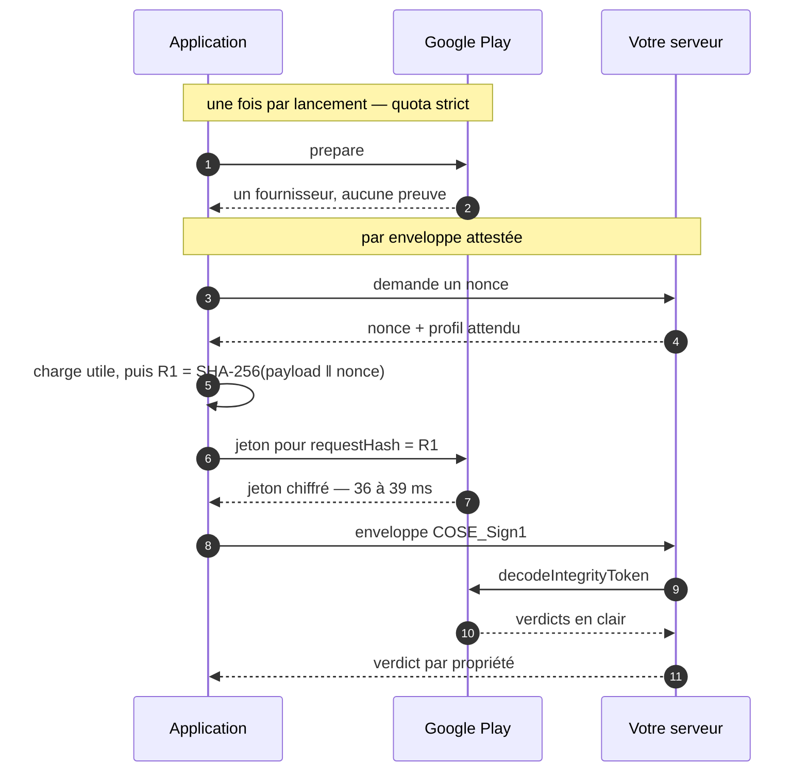
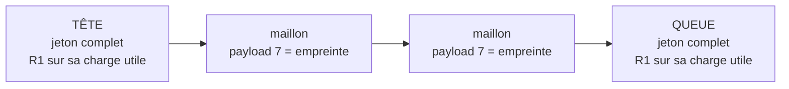
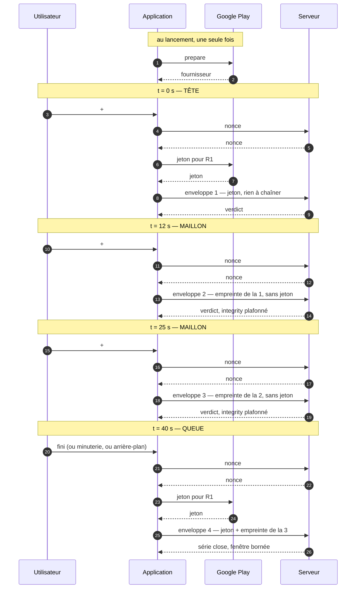
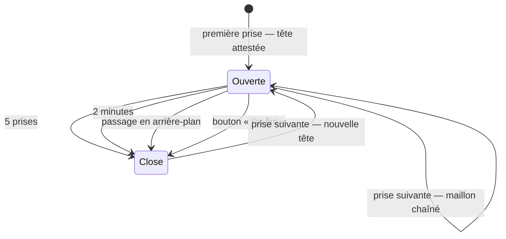

# Sessions Play Integrity et prises de vues multiples

**Ce document est opérationnel.** Il rassemble ce qu'il faut savoir pour faire fonctionner
plusieurs captures à la suite sans se faire brider, et ce que cela change à la preuve.

La **décision** vit ailleurs : `decisions/ADR-0009-serie-de-captures-et-chainage.md`. Le
**raisonnement** qui y a mené aussi : `acquisition-et-liaisons.md` §4. Ici, ce sont les
mécanismes, les chiffres mesurés et les pièges.

Ne pas confondre avec `play-integrity-service-account.md`, qui couvre la mise en place —
compte de service, projet Cloud, publication. Celui-ci couvre l'**exécution**.

---

## 1. Trois appels qu'on appelle tous « Play Integrity »

C'est la source de confusion la plus coûteuse, et elle mène à optimiser le mauvais.

| | Qui appelle | Quand | Coût mesuré | Quota |
|---|---|---|---|---|
| **`prepare`** | l'appareil → Google | mise en route du fournisseur | 332 – 1 313 ms | **strict** |
| **demande de jeton** | l'appareil → Google | par enveloppe attestée | 36 – 39 ms | large |
| **`decodeIntegrityToken`** | **votre serveur** → Google | par enveloppe vérifiée | 340 – 930 ms | serveur |



Trois choses en découlent :

- **`prepare` ne produit aucune preuve.** Il rend un *fournisseur*, pas un jeton. Le
  refaire n'atteste rien et ne clôt aucune série.
- **La demande de jeton est bon marché** — deux ordres de grandeur sous `prepare`. Ce
  n'est jamais elle qui domine une latence de capture.
- **Le déchiffrement est côté serveur**, donc soumis à *votre* quota Google Cloud et non à
  celui de l'appareil. Un déploiement doit le dimensionner : c'est une requête par
  enveloppe reçue.

---

## 2. Ce qui a été mesuré le 2026-08-17, sur SM-X200

**Le bridage est réel et rapide à atteindre.** Cinq campagnes en vingt secondes ont
suffi :

```
Standard Integrity API error (-8): The calling app has made too many requests
to the API and has been throttled, or your app has exceeded its daily request quota.
```

Puis huit échecs consécutifs, sur environ douze secondes. Le serveur, lui, répondait `200`
à toutes les requêtes : **rien n'était cassé côté format**.

Le message mêle deux limites qu'il ne distingue pas — une cadence instantanée et un quota
journalier. Sur ce banc c'est la cadence qui a mordu, la journée entière n'ayant pas
dépassé quelques dizaines d'appels. Un déploiement réel devra surveiller les deux.

### L'hypothèse du `prepare` répété

Jusqu'à la version 0.3.0, la sonde appelait `prepare` **au début de chaque campagne** —
donc cinq fois en vingt secondes. Or `prepare` porte le quota strict, la demande de jeton
le quota large.

**Il est donc possible que le bridage vienne des `prepare` et non des jetons.** Ce n'est
pas établi. La version 0.3.0 prépare une seule fois par lancement, ce qui teste
l'hypothèse sans rien réimplémenter : si une rafale passe désormais sans brider, la cause
était là.

Cette distinction n'est pas académique. Si c'est `prepare`, le remède est de le préparer
une fois et de le réutiliser — et la contrainte sur la cadence des captures tombe presque
entièrement.

### Le blocage du 2026-08-18, et ce qu'il faut en faire

**Le bridage est revenu alors que `prepare` n'était plus appelé qu'une fois par
lancement.** Il a frappé `prepare` lui-même, dans un processus neuf, sans qu'aucune
demande de jeton ne l'ait précédé :

```
-8 : The calling app has made too many requests to the API and has been throttled,
     or your app has exceeded its daily request quota.
     Retry with an exponential backoff. Request an increase to your daily request
     quota if you're at your daily request limit.
```

Ce jour-là : douze vérifications abouties, plus les campagnes de la veille, plus un
`prepare` à chaque relance de l'application — et il y en a eu beaucoup, chaque
téléversement de piste interne en imposant une.

**Le message confond deux limites et ne dit pas laquelle a mordu** : une cadence
instantanée, et un quota journalier. Le client ne peut pas les distinguer. C'est la
première chose à lever, et elle ne coûte rien.

#### Ce qui n'est pas su, et qui se vérifie

- **Quelle limite a été atteinte.** La Play Console (*Protégé avec Play → API Play
  Integrity*) et la console Cloud du projet lié affichent la consommation. À regarder
  avant toute conclusion — la veille, une hypothèse plausible (`prepare` répété) s'est
  révélée exacte, mais elle ne l'est plus aujourd'hui.
- **La valeur du quota journalier** par défaut, et si le compte l'a relevé. Non vérifié à
  ce jour ; **ne pas se fier à un chiffre de mémoire**, la documentation de Google ayant
  changé plusieurs fois.
- **Le coût d'un `prepare`** dans ce quota — compte-t-il comme une requête, ou relève-t-il
  d'une limite propre ? Le comportement observé suggère une limite propre et plus stricte,
  sans que ce soit établi.

#### Ce que ça dimensionne, et c'est le vrai sujet

**Le verdict d'appareil de Google a un coût unitaire et un plafond journalier.** Un
déploiement de *N* appareils prenant *M* captures par jour fait *N × M* appels : il existe
donc un nombre maximal de captures vérifiables par jour, indépendamment de tout le reste.

Ce n'est pas une contrainte d'exploitation qu'on absorbe en réglant un paramètre. C'est une
borne qui décide si l'architecture tient à l'échelle visée, et elle doit être connue avant
de promettre quoi que ce soit.

**C'est aussi ce qui donne à ADR-0010 et ADR-0011 une portée qu'ils n'avaient pas.**
Écrits pour le hors ligne, ils sont les deux seules voies qui ne se heurtent pas au quota :

- `key-attestation` (ADR-0010) ne demande **rien** à Google. C'est ce qui a permis de
  finir la campagne du 2026-08-18 après épuisement du quota ;
- le jeton par campagne (ADR-0011 point 5, repli) divise le nombre d'appels par le nombre
  de prises.

#### Pistes, dans l'ordre où les instruire

1. **Lire la consommation réelle** en Play Console et en console Cloud. Gratuit, et sans
   cela tout le reste est de la conjecture.
2. **Demander une augmentation de quota** si la limite journalière est bien celle
   atteinte. Google prévoit un formulaire ; disproportionné pour un banc, nécessaire pour
   un déploiement.
3. **Implanter un repli exponentiel**, que le message de Google recommande explicitement.
   La sonde n'en fait aucun : elle échoue et rapporte. Acceptable pour une sonde, pas pour
   une application de terrain.
4. **Nommer le cas dans la sonde.** Aujourd'hui elle rapporte `ExecutionException` et le
   message brut ; elle devrait dire « bridé par Google » et **suggérer le mode hors
   ligne**, qui est déjà là.
5. **Réduire structurellement les appels** — c'est ADR-0011, et le quota lui ajoute un
   argument que son auteur n'avait pas prévu.

**Un piège de raisonnement à éviter ici**, et c'est le même qu'au § suivant : le quota ne
doit pas devenir la justification de la série. Il change sans préavis, et l'argument tomberait
avec lui. La série se justifie par ce qu'elle prouve ; le quota est une raison de plus de
l'implémenter tôt, pas une raison d'exister.

---

## 3. Ce qu'une série prouve, et ce qu'elle coûte

Une **série** — plusieurs captures d'un même constat — établit deux choses qu'une suite de
prises indépendantes n'établit pas :

- l'**ordre** des prises ;
- l'**absence de retrait** : personne n'a enlevé la photo gênante.

La forme retenue (ADR-0009) :



Chaque flèche est une empreinte : le maillon porte le `SHA-256` de l'enveloppe qui le
précède, et le serveur confronte à ce qu'il a retenu de son côté
(`DeviceRecord.last_envelope_digest`). C'est leur accord qui vaut vérification — rien
n'est déclaré.

**Deux jetons par série, quelle que soit sa longueur.** C'est ce qui met la cadence hors
de portée du quota.

### Trois photos dans la même minute

Le cas concret, avec ce qui part sur le réseau à chaque geste :



**Deux appels à Google pour toute la minute**, quel que soit le nombre de photos. Les
nonces, eux, sont demandés à *votre* serveur à chaque enveloppe : aucun quota, et c'est
ce qui préserve R3 sur chaque prise.

À comparer à ce que fait la démonstration aujourd'hui — un jeton par photo, soit quatre
appels ici, et cinq suffisent à faire brider.

> **La queue de la figure n'est pas obligatoire — ADR-0009 amendé le 2026-08-17.**
> Chaque maillon demande son propre nonce, donc le serveur mesure lui-même la distance
> qui le sépare de la dernière attestation, avec sa propre horloge. La fenêtre est déjà
> bornée sans queue ; celle-ci ne fait que **resserrer** la note.
>
> Ce que cela retire : l'enveloppe de clôture supplémentaire — qui était nécessaire tant
> qu'on croyait la queue obligatoire, puisqu'on ne sait pas à l'avance quelle photo sera
> la dernière — et tout geste obligatoire de l'utilisateur.
>
> Un attaquant ne gagne donc rien à ne pas clore : sa chaîne s'éloigne de son attestation,
> et le grade tombe de lui-même.

### Ce qu'un maillon perd, et qu'il faut dire

La chaîne prouve l'**ordre**, jamais la **santé continue** de l'appareil. Quelqu'un qui
obtient une tête attestée puis compromet le téléphone peut prolonger la chaîne : le
vérificateur n'y verra rien.

D'où deux règles qui ne se négocient pas :

- `integrity` est **plafonné** sur un maillon, sous le grade d'une enveloppe fraîchement
  attestée, avec un motif qui le dit ;
- ~~une série **sans queue attestée** est signalée~~ — **amendé** : il n'y a rien à
  signaler, la fenêtre étant déjà mesurée. Le plafond d'`integrity` se calcule sur la
  **largeur observée** depuis la dernière attestation : un maillon à quinze secondes de sa
  tête ne vaut pas un maillon à trois heures.

`time`, en revanche, garde tout le bénéfice : `envelope-chain-verified` le promeut en A,
puisque l'ordre est exactement ce que la chaîne établit.

---

## 4. Clore une série : quatre mécanismes, aucun suffisant seul

| Mécanisme | Ce qu'il attrape | Sa limite |
|---|---|---|
| Compteur — 5 prises | la rafale | ne borne pas le temps |
| Minuterie — 2 minutes | la série qui traîne | clôt **en retard**, d'au plus un intervalle |
| Passage en arrière-plan | l'utilisateur qui s'en va | rien si l'application est tuée net |
| Bouton explicite | tout, **exactement** | suppose que l'utilisateur y pense |

Aucun n'est **obligatoire** depuis l'amendement d'ADR-0009 : tous resserrent la note, aucun
ne conditionne la validité. Une série qu'on n'a jamais close reste vérifiable ; ses derniers
maillons sont simplement notés sur une largeur plus grande.



Le bouton reste donc utile mais **facultatif** : les trois premiers le rendent optionnel
plutôt qu'obligatoire, ce qui est une bien meilleure position produit.

**Une minuterie ne remplace pas une clôture exacte.** Une attestation obtenue 60 s après
la dernière photo borne la fenêtre à 60 s, pas à la photo. C'est acceptable — infiniment
mieux qu'une série ouverte — mais c'est un affaiblissement mesurable, et le résultat doit
pouvoir le refléter.

Les valeurs 5 prises / 2 minutes sont des **points de départ**, au même titre que les
seuils de `grading.py` : assez lâches pour ne pas rappeler le quota, assez serrées pour
que la fenêtre reste courte. À recalibrer sur données réelles.

---

## 5. Où en est l'implémentation

| | État |
|---|---|
| Chaînage `payload[7]` côté cœur Android | **Fait** — 0.3.0 |
| Validation de chaîne côté vérificateur | **Faite depuis longtemps** — `CHAIN_BROKEN`, `CHAIN_FIRST_LINK_UNKNOWN`, `envelope-chain-verified` |
| Enrôlement stable, `prepare` unique | **Fait** — 0.3.0 |
| Politique de clôture | **Faite** — 0.3.1 |
| `freshness` optionnel (spec + CDDL) | **Non fait** |
| Notation d'un maillon sans jeton | **Non faite** |
| Signalement d'une série sans queue | **Non fait** |

**Conséquence à ne pas perdre de vue.** Tant que `freshness` est obligatoire, *toutes* les
enveloppes portent un jeton : la série est attestée en chacun de ses points, et la
segmenter ne change rien à ce qui est prouvé. La politique de clôture existe donc **avant**
son effet. Elle décidera où se placent les points attestés le jour où les maillons
cesseront d'en porter.

C'est aussi pourquoi le bridage n'a pas encore disparu : deux jetons par série ne
s'obtiennent qu'une fois `freshness` rendu optionnel.

---

## 6. Trois pièges, tous rencontrés

### L'enrôlement par capture rend le chaînage impossible

Jusqu'à la 0.3.0, la démonstration générait une clé neuve à chaque campagne. Une clé neuve
donne un `kid` neuf, donc **un appareil neuf pour le serveur**, donc jamais de maillon
précédent. Le chaînage était impossible par construction, et `CHAIN_FIRST_LINK_UNKNOWN`
apparaissait à chaque prise sans que la cause saute aux yeux.

En production l'enrôlement est un événement d'**installation**, pas de capture. Toute
démonstration qui s'en écarte se prive du chaînage sans le savoir.

### Confondre `prepare` avec une attestation

Voir §1. Refaire `prepare` périodiquement est une bonne pratique de **quota** ; cela ne
clôt aucune série et n'atteste rien.

### Prendre le quota pour la justification de la série

C'est le piège de raisonnement, et le plus coûteux à long terme. Un quota relève de
l'exploitation : il change sans préavis, diffère d'un compte à l'autre, et peut être
relevé demain. **La série se justifie par ce qu'elle prouve** — qu'aucune prise ne manque.
Si elle avait été conçue pour contourner une limite commerciale, elle deviendrait un
résidu qu'on n'oserait plus retirer le jour où la limite disparaît.

Le dépôt a une règle pour cela : *ce qui change le format se tranche, ce qui change
l'exploitation se configure.*

---

## Note sur les figures

Elles sont en **Mermaid**, et non produites par `tools/gen_sequences.py`. Cet outil écrit
du SVG *à l'intérieur* de `architecture.html`, entre marqueurs, et son rendu dépend des
classes CSS définies dans le `<style>` de cette page : un SVG extrait s'afficherait sans
mise en forme. Mermaid reste du texte, donc lisible en diff, et GitHub le rend
nativement.

Corollaire : ces figures **se modifient à la main**, contrairement à celles
d'`architecture.html` qu'il ne faut jamais éditer directement.

---

## Renvois

- `decisions/ADR-0009-serie-de-captures-et-chainage.md` — la décision et ses sept points
- `decisions/ADR-0008-propriete-de-la-session-de-capture.md` — qui possède la caméra
  pendant une séance
- `decisions/ADR-0006-authentification-google-injectable.md` — pourquoi l'appel à Google
  par enveloppe est subi et non choisi
- `play-integrity-service-account.md` — la mise en place, en amont de ce document
- `acquisition-et-liaisons.md` §4 — le raisonnement d'origine sur la série
- `envelope-spec.md` §9 — les décisions ouvertes restantes, dont le niveau visé par une
  série hors ligne
